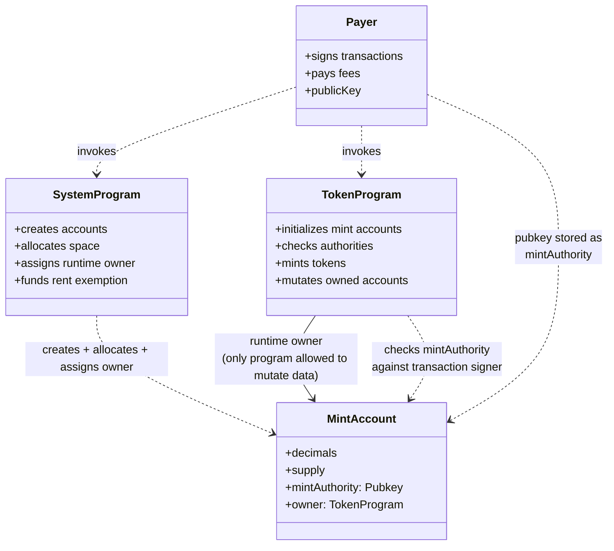

# Pre-builder assignment 2: SPL tokens and Core NFTs on devnet

Two problem sets, both centered on the same crux: establishing a token-shaped abstraction on Solana devnet and then interacting with it. The first does it with the older SPL token primitives directly (init the mint, attach metadata, mint a supply, transfer it). The second does it through [Metaplex](https://www.metaplex.com/)'s mpl-core, which collapses much of that ceremony into a single asset account, with plugins extending behavior in place (upload image, upload metadata, create the asset, attach a plugin).

## Problem set 01: SPL token, ye olde way

### SPL init

The mint account in `src/spl/spl_init.ts` sits at the intersection of two relationships that Solana keeps deliberately distinct:

- **ownership** (runtime: which program is allowed to mutate the account's data); and
- **authority** (capability: which key the program checks before minting).

It is easy to conflate them, so it is worth being explicit. The Token Program owns the mint account at runtime, meaning only it can write to the account; but the mint account *stores* a `mintAuthority` pubkey, which the Token Program checks against the transaction signer when someone asks it to mint. So "owner" answers "who can edit?", "authority" answers "who can authorize a mint?", and they need not be the same key.

<details>
<summary>Entity relationship diagram</summary>



</details>

Artifacts:

1. [SPL Init Tx](https://solscan.io/tx/K2vNGWJBSuseQWaT1aVAKVJKvxuwQbT8UK4urfZHcSYUrSz8Gqx6ydBoHMuEL6pHJYGQLg5HDzVdBNCTgE93EC6?cluster=devnet)
1. [Mint address `G29naZ...vgh`](https://solscan.io/token/G29naZ3fRs31Be3jRSw7ssp4yedqTcbBeBqJzUP66vgh?cluster=devnet)

### SPL metadata

Attaches a Metaplex Token Metadata account to the mint above (`src/spl/spl_metadata.ts`). The `dataV2` payload is the on-chain shape; the bits that actually matter for a wallet rendering this token are `name`, `symbol`, and `uri`.

1. [SPL Metadata Tx](https://solscan.io/tx/2sEXhGvXQgddKGMRqiy29rii1q7HkosV624rB2xuMScqyqF2jSsRnY6x8JEuVKDapXqzF2RSTaVzWUskCutmLTw6?cluster=devnet)

   ```json
   {
     "discriminator": { "type": "u8", "data": 33 },
     "dataV2": {
       "type": "u8",
       "data": {
         "name": "kata koin",
         "symbol": "Katha",
         "uri": "https://www.youtube.com/watch?v=F38ZRgp_N6k",
         "sellerFeeBasisPoints": 1,
         "creators": null,
         "collection": null,
         "uses": null
       }
     },
     "isMutable": { "type": "u8", "data": true },
     "collectionDetails": { "type": "u8", "data": null }
   }
   ```

### SPL mint

Issues supply to a token account owned by the payer (`src/spl/spl_mint.ts`). After this runs, the wallet that signed has tokens it can transfer.

1. [SPL Mint Tx](https://solscan.io/tx/2vnmSwWHKH67iBnh9A76krpjsoXn38h88S736s1zEaJQ8mQ2EgCurDtDAeTooJfAAHuGCrPV8z2htYQ9UyqQw2eV?cluster=devnet) (creates the payer's [ATA `Egvsaqw...BC5m`](https://solscan.io/account/EgvsaqwUU36MriwxpTJES7Nz5fUrTDGpFXmBrKrXBC5m?cluster=devnet) in the same tx, then mints 1,000,000 raw units to it)

### SPL transfer

Moves tokens from the payer's associated token account to a recipient's (`src/spl/spl_transfer.ts`). If the recipient ATA does not exist yet, it gets created in the same transaction.

1. [SPL Transfer Tx](https://solscan.io/tx/66ku3978m8xJ7UtrrBmfQ4B4rhSfmJHXv3B8ssV8eYTXzphrWiBUc22fNhnfbW2xmGPsea9ed1YejtFU9vhBi2Cd?cluster=devnet)

## Problem set 02: Metaplex silky smooth goodness

This set uses [mpl-core](https://developers.metaplex.com/core), Metaplex's newer single-account NFT standard. A Core asset lives in *one* account (no separate metadata account, no master edition); plugins extend its behavior in place.

### Upload assets

Image and metadata are uploaded to Irys. The metadata JSON references the image URL.

1. [NFT Image](https://gateway.irys.xyz/CY68pPxTmnRuaDDDeKpD6A6bSxXEGTCqUX2D78vJhFzg)
1. [NFT Metadata](https://gateway.irys.xyz/Fz4CHtp9PcPSmhLCkXfQikfLgBi2Ld9oBVZ6de8giTiy)

### Create the asset

`src/nft/nft_mint.ts` calls mpl-core's `create`, which allocates a single asset account and points it at the metadata URI above.

1. [NFT Mint Tx](https://solscan.io/tx/2X2Ke6wB18jsgh5u8M45dWkdxW3441ma3RqYzSkd4DZBmZJTLLw1mTDRvwkrKAdv7dkqaAatBo75V9yRKZ18GPhY?cluster=devnet)
1. [Asset account `A7tFTCdj...z7S`](https://solscan.io/account/A7tFTCdjYSzvFr88ue5Ny51MtDFwXUxCw5AsAdR13z7S?cluster=devnet)

### Autograph plugin

The Autograph plugin lets named addresses leave a signed message on the asset (think: collectible signed by the artist). `src/nft/nft_autograph.ts` calls `addPlugin` to attach one to the existing asset.

A natural question: why is this an `addPlugin` call rather than something we passed into `create`? Either works; the create-time form bakes the plugin in at mint, while `addPlugin` attaches it later (and only if no Autograph plugin is already there). I went with the post-hoc form here because the asset already existed from the previous step.

Remark/Question: the on-chain instruction data dump below has a shape I don't understand; I'm not sure why the plugin has an integer key "0", indicating multiple entries. Try and figure it out before asking instructors.

1. [Autograph Plugin Tx](https://solscan.io/tx/4v961aKvLQyGDnw9Zimc3mHffS2wR9Sc2QTsyzE3dAorg8rwoe2E5kgo5whbcnLWfgF34sTY2XhtbS6ezRk2KUqM?cluster=devnet)

   ```json
   {
     "discriminator": { "type": "u8", "data": 2 },
     "plugin": {
       "type": "u8",
       "data": {
         "0": {
           "signatures": [
             {
               "address": "CxqsDsA1gyRKggA2cPhGA7JbcuRJT6yNjKY53Q2xPYs4",
               "message": "Create a caption for this StrangeBrew Token!"
             }
           ]
         },
         "enumType": "autograph"
       }
     },
     "initAuthority": { "type": "u8", "data": null }
   }
   ```

   NOTE: re-running `pnpm run nft:autograph` against the same asset will fail at stimulation: mpl-core rejects `addPlugin` for a plugin type that already exists. To iterate, use `updatePlugin` (overwrites the signatures list) or `removePlugin` followed by another `addPlugin`.

## Future work
1. Investigate how to improve the DX where a dev can iterate over plugins; is this something Surfpool could help with?
1. Build an engagement campaign to choose the top-10 best captions for the NFT.
