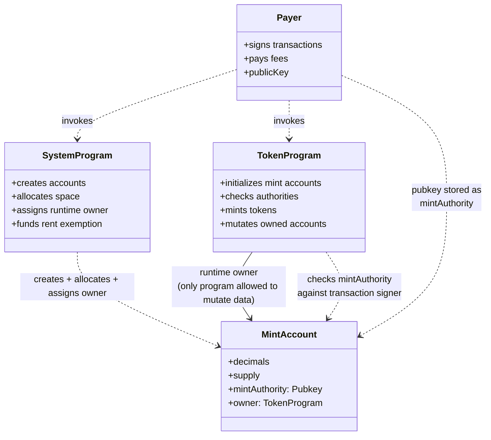

Two relationships matter for the mint account in `src/spl/spl_init.ts`:
**ownership** (runtime: who can mutate the account's data) and
**authority** (capability: who the program checks before minting).
They are deliberately distinct in Solana's account model.

